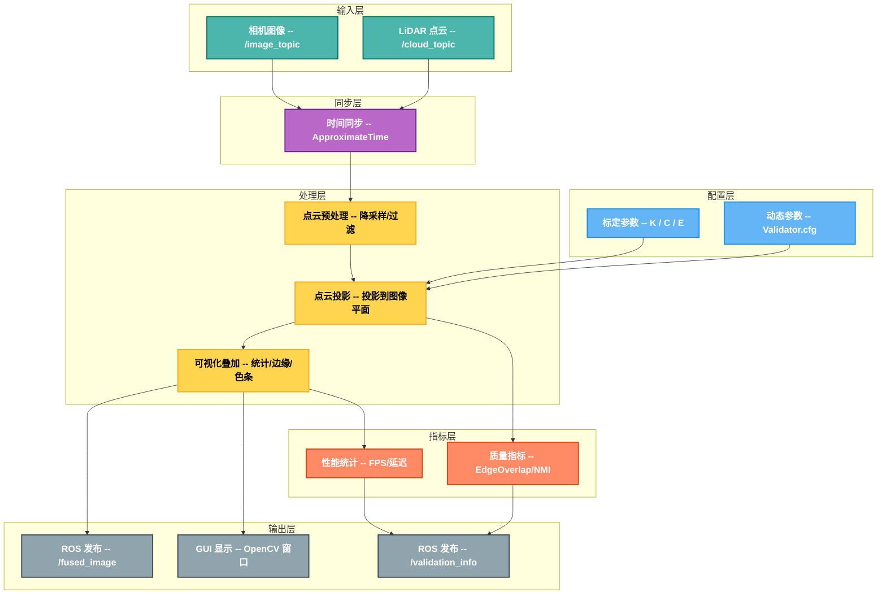
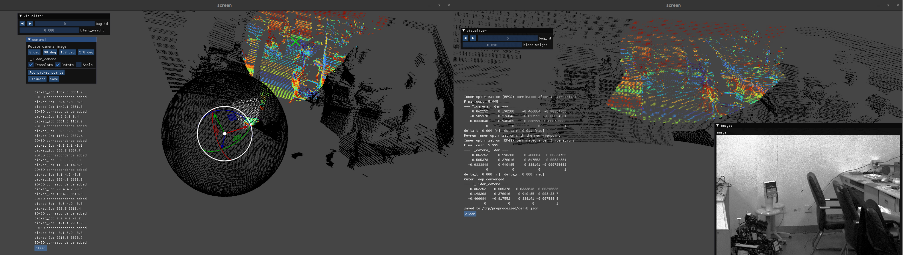
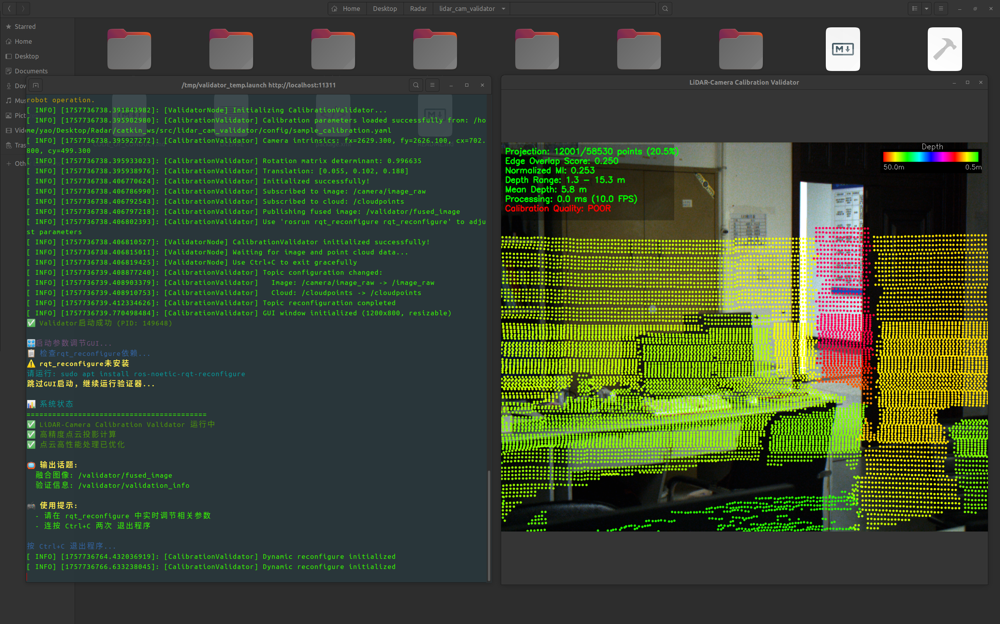

<h1 align="center">🚀 LiDAR-Camera Calibration Validator</h1>

一个用于验证激光雷达-相机联合标定质量的高性能ROS包，提供实时可视化、定量评价指标和精确的投影计算。  

A high-performance ROS package for validating LiDAR-camera calibration quality through real-time visualization, quantitative metrics, and precise projection calculations.

---

## ✨ 主要特性 | Key Features

### 🌟 核心功能
- **高精度投影**: 包含完整畸变校正的精确点云投影计算

- **定量评价指标**: 边缘重叠度、归一化互信息等多种质量评价指标

- **实时参数调节**: 通过动态重配置进行无重启参数调整

- **边缘检测分析**: Canny边缘检测和重叠分析

- **性能监控**: 实时FPS、处理时间等性能统计

  ---
## 🎨 效果展示 | Effect Showcase


<p align="center">
  
</p>

<p align="center">
  <em>图 1：LiDAR-Camera Calibration Validator 系统概览 (LCCV Overview)</em>
</p>


---

## 📊 系统流程图 | System Flow


---
## 🔍 推荐标定工具 | Recommended Calibration Tools

在使用本验证工具前，建议先完成 **相机标定** 与 **激光雷达-相机联合标定**，以保证结果的准确性。

### 📷 相机标定 (Camera Calibration)

- [ROS 官方相机标定工具](https://wiki.ros.org/camera_calibration)  
   提供单目/双目相机标定，输出相机内参与畸变参数。
  

<p align="center">
  
</p>
<p align="center">
  <em>图 2：ROS 相机标定示例 (Camera Calibration Example)</em>
</p>

---

### 🔗 激光雷达-相机联合标定 (LiDAR-Camera Extrinsic Calibration)

- [direct_visual_lidar_calibration (GitHub)](https://github.com/koide3/direct_visual_lidar_calibration)  
   基于视觉与点云的高精度标定工具。
  
- [官方教程 | Official Tutorial](https://koide3.github.io/direct_visual_lidar_calibration/)  
   包含安装、数据准备、运行示例等详细步骤。

<p align="center">
  
</p>
<p align="center">
  <em>图 3：激光雷达-相机联合标定效果 (LiDAR-Camera Calibration Result)</em>
</p>

<p align="center">
  
</p>
<p align="center">
  <em>图 4：激光雷达-相机联合标定过程 (LiDAR-Camera Calibration Process)</em>
</p>

---


## 🛠️ 系统要求 | System Requirements

### 必需依赖 | Required Dependencies

#### 核心依赖
- **ROS Noetic** - Ubuntu 20.04
- **OpenCV 4.x** 
- **PCL 1.10+** 
- **Eigen3**
- **dynamic_reconfigure** 

#### GUI依赖 (可选)
- **python3-rospkg** 

- **ros-noetic-rqt-reconfigure**

- **ros-noetic-rqt-gui** 

  ---

## 📦 安装指南 | Installation Guide

### 一键安装 

#### 1. 克隆项目
```bash
mkdir -p ~/catkin_ws/src

cd ~/catkin_ws/src
git clone https://github.com/BreCaspian/LiDAR-Camera_Calibration_Validator.git
cd LiDAR-Camera_Calibration_Validator
```

#### 2. 检查依赖状态
```bash
./scripts/quick_start.sh --check-deps
```

#### 3. 根据提示安装依赖
```bash
# 如果有缺失依赖，按照脚本提示安装 (可选GUI依赖如果实在装不上可以跳过)
```
---
## 🚀 快速开始 | Quick Start

### 一键启动 (推荐)

#### 快速启动使用
```bash
# 进入项目目录
cd ~/catkin_ws/src/lidar_cam_validator

# 编辑配置标定参数
vim ~/catkin_ws/src/lidar_cam_validator/config/sample_calibration.yaml

# 分别启动 LiDAR 和 Camera ROS驱动 发布相关话题

# 一键启动（将会自动编译、启动验证器、参数GUI、可视化GUI）
./scripts/quick_start.sh -i /camera/image_raw -c /velodyne_points 
# 请替换为您的 相机图像话题 /camera/image_raw 和 点云话题 /velodyne_points 
```
---

## 高级选项 | Advanced Options
```bash
# 检查依赖状态
./scripts/quick_start.sh --check-deps

# 运行系统测试
./scripts/quick_start.sh --test

# 强制重新编译
./scripts/quick_start.sh --force-compile

# 指定话题启动
./scripts/quick_start.sh -i /camera/image_raw -c /velodyne_points

# 指定标定文件
./scripts/quick_start.sh -f /path/to/your/calibration.yaml

# 不启动GUI
./scripts/quick_start.sh --no-gui

# 查看完整帮助
./scripts/quick_start.sh --help
```

### 1. 手动启动 (高级用户操作选项)

#### 启动验证器
```bash
# 设置ROS环境
source /opt/ros/noetic/setup.bash
source ~/catkin_ws/devel/setup.bash

# 启动验证器
roslaunch lidar_cam_validator validator.launch

# 启动参数调节界面 (新终端)
rosrun rqt_reconfigure rqt_reconfigure
```

### 2. 配置标定参数

#### 编辑标定文件
```bash
vim ~/catkin_ws/src/lidar_cam_validator/config/sample_calibration.yaml
```

#### 标定参数格式
```yaml
# 相机内参矩阵 (3x3)
K_0: !!opencv-matrix
   rows: 3
   cols: 3
   dt: d
   data: [fx, 0, cx, 0, fy, cy, 0, 0, 1]

# 相机畸变系数 (1x5) - 支持径向和切向畸变校正
C_0: !!opencv-matrix
   rows: 1
   cols: 5
   dt: d
   data: [k1, k2, p1, p2, k3]

# 外参矩阵: 激光雷达 -> 相机 (4x4) (若是 相机 -> 雷达，请务必求逆！！！)
E_0: !!opencv-matrix
   rows: 4
   cols: 4
   dt: d
   data: [R11, R12, R13, tx,
          R21, R22, R23, ty,
          R31, R32, R33, tz,
          0,   0,   0,   1]
```

### 3. 配置话题设置

#### 方法一：命令行指定 (推荐)
```bash
./scripts/quick_start.sh -i /your_camera/image_raw -c /your_lidar/cloudpoints
```

#### 方法二：编辑配置文件
```bash
vim ~/catkin_ws/src/lidar_cam_validator/config/settings.yaml
```

```yaml
image_topic: "/camera/image_raw"    # 替换为您的相机图像话题
cloud_topic: "/cloudpoints"        # 替换为您的点云话题

fused_topic: "/validator/fused_image"
info_topic: "/validator/validation_info"

calibration_file: "$(find lidar_cam_validator)/config/sample_calibration.yaml"

```

---

## ⚙️ 参数配置 | Parameter Configuration

### 动态参数调节 (实时生效)

使用rqt_reconfigure进行实时参数调节，所有修改立即生效，无需重启节点：

#### 可视化参数组 (Visualization)
| 参数名 | 类型 | 范围 | 默认值 | 描述 |
|--------|------|------|--------|------|
| **point_size** | int | 1-8 | 3 | 点云显示大小 (像素) |
| **enable_depth_color** | bool | - | true | 启用深度颜色编码 |
| **show_statistics** | bool | - | true | 显示统计信息 |
| **alpha** | double | 0.0-1.0 | 0.7 | 图像透明度 |

#### 处理参数组 (Processing)
| 参数名 | 类型 | 范围 | 默认值 | 描述 |
|--------|------|------|--------|------|
| **enable_edge_detection** | bool | - | true | 启用边缘检测分析 |
| **enable_metrics** | bool | - | true | 启用详细评价指标 |
| **enable_distortion_correction** | bool | - | true | 启用畸变校正 |
| **depth_filter_threshold** | double | 0.01-1.0 | 0.01 | 深度过滤阈值 (米) |

#### 性能参数组 (Performance)
| 参数名 | 类型 | 范围 | 默认值 | 描述 |
|--------|------|------|--------|------|
| **enable_parallel_processing** | bool | - | true | 启用并行处理 |
| **high_density_threshold** | int | 10000-1000000 | 100000 | 高密度点云阈值 |
| **batch_size** | int | 1000-50000 | 50000 | 批处理大小 |
| **num_threads** | int | 1-16 | 4 | 处理线程数 |

#### 控制参数组 (Control)
| 参数名 | 类型 | 描述 |
|--------|------|------|
| **reset_to_defaults** | bool | 一键重置所有参数到默认值 |

---

## 系统输出 | System Output

### 可视化输出

#### 主显示窗口
- **融合图像**: 点云投影叠加到相机图像
- **深度颜色编码**: 彩色深度映射 (红色=近，蓝色=远)
- **颜色条**: 右上角深度范围指示器
- **统计信息**: 左上角实时处理统计

<p align="center">
  
</p>
<p align="center">
  <em>图 5：验证器可视化界面 (Visualization GUI Overview)</em>
</p>

#### 界面元素
- **点云可视化**: 3像素默认点大小，清晰可见
- **边缘检测**: Canny边缘检测叠加显示
- **性能监控**: FPS、处理时间、点云数量
- **质量指标**: 边缘重合度、归一化互信息

### ROS话题输出
- **`/validator/fused_image`**: 融合后的图像 (sensor_msgs/Image)
- **`/validator/validation_info`**: 验证信息和统计数据
- **`/validator_node/parameter_descriptions`**: 发布参数描述信息
- **`/validator_node/parameter_updates`**: 发布参数变更事件


---

## 📝 开发指南 | Development Guide

```
lidar_cam_validator/
├── 📁 include/
│   └── 📄 calibration_validator.h      # 核心功能类的头文件定义
├── 📁 src/
│   ├── 📄 calibration_validator.cpp    # 核心算法和功能的实现
│   └── 📄 validator_node.cpp          # ROS 节点入口，负责数据订阅与发布
├── 📁 scripts/
│   └── 🚀 quick_start.sh              # 一键启动与测试脚本
├── 📁 config/
│   ├── ⚙️ Validator.cfg               # 动态调参配置文件 (rqt_reconfigure)
│   ├── 📝 sample_calibration.yaml    # 标定参数示例文件 (Extrinsics)
│   └── 🔧 settings.yaml              # 话题名称与框架参数设置
├── 📁 launch/
│   └── ▶️ validator.launch           # ROS 启动文件，集成所有节点和配置
├── 📖 README.md                       # 项目说明文档
└── 📜 CMakeLists.txt                 # CMake 构建配置文件
```
---

## 📐 数学原理 | Mathematical Foundations

- 本节简述该工具相关数学原理，由于该工具侧重于实用，故只简单给出相关数学定义与数学表达，以便交流讨论
- 个人数学功底一般，若有问题，欢迎批评指正
> 个人简单定义从 LiDAR 点到图像像素的投影模型，以及用于验证标定质量的定量指标。符号与配置字段对应：  
> `E_0` (外参, $T_{C\leftarrow L}$)、`K_0` (内参, K)、`C_0` (畸变, k1/k2/k3, p1/p2)。

---

### 1) 坐标系与外参 | Frames & Extrinsics

- LiDAR 坐标系记为 **{L}** ，相机坐标系记为 **{C}** 。  
- 外参矩阵（LiDAR → Camera）记为：

```math
\mathbf{T}_{C\leftarrow L}=
\begin{bmatrix}
\mathbf{R} & \mathbf{t}\\
\mathbf{0}^\top & 1
\end{bmatrix}
\in SE(3),\quad \mathbf{R}\in SO(3),\ \mathbf{t}\in\mathbb{R}^3
```

* 将 LiDAR 点 \$\mathbf{x}\_L=(x\_L,y\_L,z\_L)^\top\$ 变换到相机坐标：

```math
\begin{bmatrix}\mathbf{x}_C\\1\end{bmatrix}
=\mathbf{T}_{C\leftarrow L}\begin{bmatrix}\mathbf{x}_L\\1\end{bmatrix},
\quad \mathbf{x}_C=(X,Y,Z)^\top
```

* **可见性约束**：仅当 \$Z>0\$（点在相机前方）时才继续投影。
* 若标定工具给出的外参矩阵是 \$\mathbf{T}\_{L\leftarrow C}\$（Camera→LiDAR），须取逆：

```math
\mathbf{T}_{C\leftarrow L}=\left(\mathbf{T}_{L\leftarrow C}\right)^{-1}
```

---

### 2) 针孔成像与畸变 | Pinhole Projection with Distortion

**(2.1) 归一化针孔坐标**

```math
x_n=\frac{X}{Z},\qquad y_n=\frac{Y}{Z}
```

**(2.2) 透镜畸变（Brown–Conrady 模型）**
令 \$r^2=x\_n^2+y\_n^2\$，径向系数 \$(k\_1,k\_2,k\_3)\$、切向系数 \$(p\_1,p\_2)\$：

```math
\begin{aligned}
x_d &= x_n\!\left(1+k_1 r^2+k_2 r^4+k_3 r^6\right)
      + 2p_1 x_n y_n + p_2\!\left(r^2+2x_n^2\right),\\
y_d &= y_n\!\left(1+k_1 r^2+k_2 r^4+k_3 r^6\right)
      + p_1\!\left(r^2+2y_n^2\right) + 2p_2 x_n y_n
\end{aligned}
```

> 说明：上式为 **从理想归一化坐标到畸变归一化坐标** 的前向模型。

**(2.3) 内参映射至像素坐标**
设内参矩阵：

```math
\mathbf{K}=\begin{bmatrix}
f_x & 0 & c_x\\
0 & f_y & c_y\\
0 & 0 & 1
\end{bmatrix}
```

则像素坐标：

```math
u=f_x\,x_d + c_x,\qquad v=f_y\,y_d + c_y
```

**像素有效性**：要求 \$(u,v)\$ 落入图像分辨率范围内；可选 Z-buffer（较小 \$Z\$ 优先）以减少遮挡误差。

---

### 3) 定量指标 | Quantitative Metrics

**(3.1) 边缘重合度（Edge Overlap Score）**

* 用 Canny 得到二值边缘图 \$E\in{0,1}^{H\times W}\$，对其做欧氏距离变换得 \$D\in\mathbb{R}\_{\ge 0}^{H\times W}\$。
* 设有效投影像素集合 \$\mathcal{P}={(u\_i,v\_i)}\_{i=1}^N\$，阈值 \$\tau\$（像素）：

```math
\mathrm{Overlap}=\frac{1}{N}\sum_{i=1}^{N}\mathbf{1}\!\left[D(v_i,u_i)\le \tau\right]
```

* **个人理解**：值越大对齐越好； $\tau$ 可取 2–5 像素（依分辨率/噪声而定）。

**(3.2) 归一化互信息（Normalized Mutual Information, NMI）**

* 取投影像素的灰度 \${I\_i}\$ 与对应深度 \${Z\_i}\$，离散化成联合直方图 \$p(I,Z)\$。
* 熵与互信息：

```math
H(X)=-\sum_x p(x)\log p(x),\quad
\mathrm{MI}(I,Z)=\sum_{i,z}p(i,z)\log\frac{p(i,z)}{p(i)\,p(z)}
```

* 一种常用的 NMI 定义：

```math
\mathrm{NMI}(I,Z)=\frac{H(I)+H(Z)}{H(I,Z)}
```

* **个人理解**：NMI 越高，灰度与几何在投影处的**结构性相关**越强，通常意味着外参更准确。
  实践上对直方图 bin、对比度、采样比例敏感，建议多帧取均值或方差。

---

### 4) 数值注意事项 | Numerical Notes

* **单位一致**： \$\mathbf{t}\$ 与点坐标单位必须一致（米）。
* **远距退化**：场景多为远景时， \$(X/Z,Y/Z)\$ 对 \$\mathbf{t}\$ 的敏感性下降；建议含近景或倾斜视角数据。
* **畸变正确性**：未正确建模/应用畸变，误差在视场边缘会放大。
* **时间同步**：相机/雷达时戳不对齐在动态场景中会造成系统偏移，应对齐或做运动补偿。


---

## 🔧 贡献指南 | Contributing

1. Fork 项目到您的 GitHub 账户
2. 创建功能分支: `git checkout -b feature/your-feature`
3. 提交更改: `git commit -am 'Add some feature'`
4. 推送分支: `git push origin feature/your-feature`
5. 创建 Pull Request

---

## 📄 许可证 | License

本项目采用 GNU GPL v3 或更高版本 (GPL-3.0-or-later) 许可 - 详见 [LICENSE](LICENSE)

This project is licensed under the GNU General Public License v3.0 or later (GPL-3.0-or-later) - see the [LICENSE](LICENSE) file for details.

### 📋 您的义务

- **Copyleft保护**：基于本项目的衍生作品必须使用相同许可证

- **源码公开**：分发时必须提供源代码或提供获取源码的方式

- **许可证保留**：必须保留原始许可证和版权声明

- **修改声明**：必须明确标注对原始代码的修改

  ---

## 🤝 致谢 | Acknowledgments

- ROS社区提供的优秀框架
- OpenCV和PCL库的强大支持
- Dr. Kenji Koide 开源联合标定工具

---

## 📮 联系方式 | Contact

如有问题或建议，请通过以下方式联系：

**项目作者** : YaoYuzhuo

**电子邮箱** : yaoyuzhuo6@gmail.com

---

<p align="center">
  <b>LiDAR-Camera Calibration Validator v3.1</b> - 激光雷达-相机联合标定结果快速验证！ 🚀
</p>
