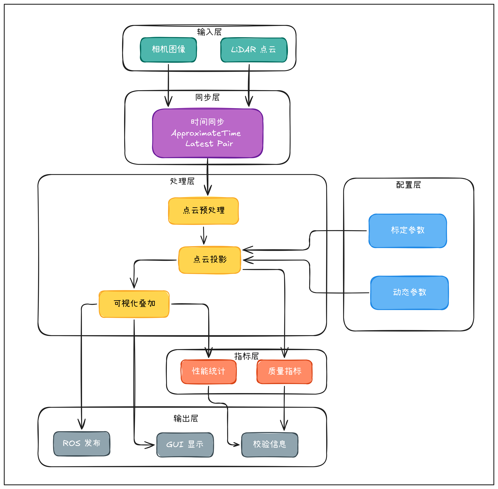
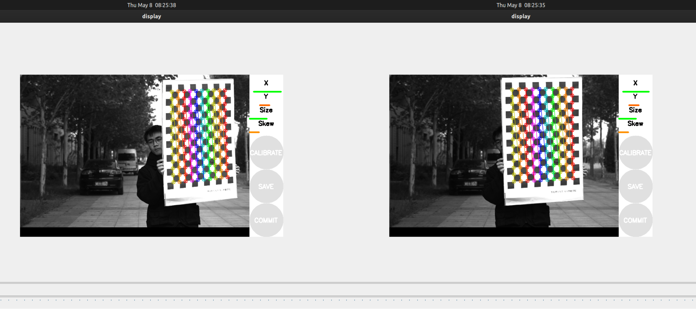
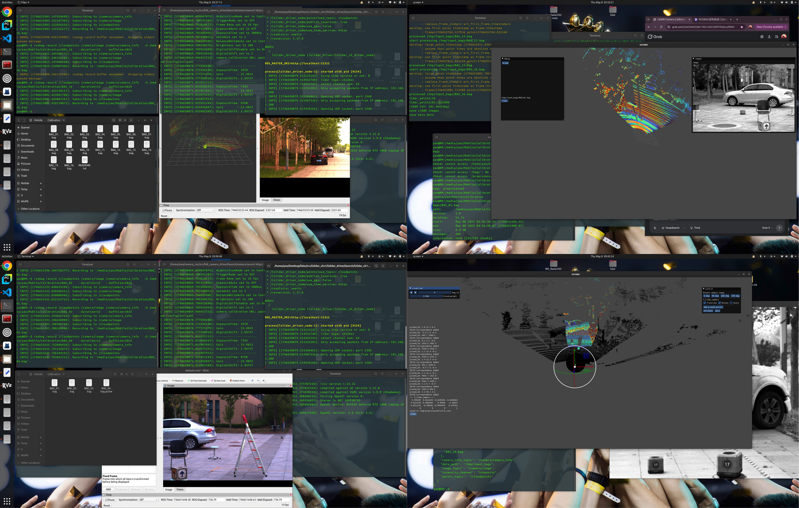
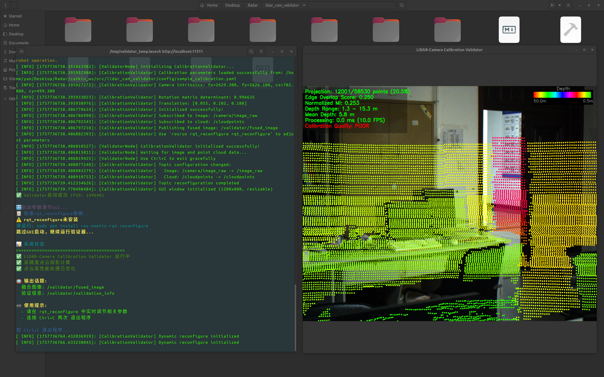

<h1 align="center">LiDAR-Camera Calibration Validator</h1>

<p align="center">
  
  
  
  
  
</p>

<p align="center">
  <a href="https://github.com/BreCaspian/LiDAR-Camera_Calibration_Validator-ROS2">LiDAR-Camera Calibration Validator ROS 2</a> |
  <a href="CHANGELOG.md">CHANGELOG</a> |
  <a href="README_EN.md">English</a>
</p>

▸ 本工具用于 LiDAR-相机联合标定结果的快速可视化校验，基于 ROS 实时同步图像与点云数据，支持畸变校正投影、边缘重合度与归一化互信息评估，并输出融合图像及指标统计结果

▸ 广泛支持各种混合固态式与非重复扫描雷达，并且不依赖于相机和激光雷达时间同步

▸ **🎉 What's New:** [已全面支持 ROS 2 Humble - 2026-03-07](https://github.com/BreCaspian/LiDAR-Camera_Calibration_Validator-ROS2)
---

## 主要特性

- 高精度投影：完整畸变校正的点云投影计算
- 定量评价指标：边缘重合度与归一化互信息
- 实时参数调节：基于 dynamic_reconfigure 的在线参数调整
- 边缘检测分析：Canny 边缘与重叠分析
- 性能监控：实时 FPS 与处理耗时统计
- 多雷达兼容：支持混合固态式与非重复扫描雷达

---

## 效果展示

<p align="center">
  
</p>

<p align="center">
  <em>图 1：LiDAR-Camera Calibration Validator 系统概览</em>
</p>

---

## 系统流程

<p align="center">
  
</p>

---

## 推荐标定工具

在使用本工具前，请先完成相机标定与联合标定。

### 相机标定

- [ROS 官方相机标定工具](https://wiki.ros.org/camera_calibration)  提供单目/双目相机标定，输出相机内参与畸变参数。

- [ROS 相机标定详细教程](https://blog.csdn.net/2401_88008105/article/details/152665216?spm=1001.2014.3001.5506) 华北理工大学-HORIZON战队-雷达组 ROS 相机标定教程。

<p align="center">
  
</p>
<p align="center">
  <em>图 2： ROS 相机标定示例</em>
</p>

---

### 激光雷达-相机外参标定

- [direct_visual_lidar_calibration (GitHub)](https://github.com/koide3/direct_visual_lidar_calibration)  基于视觉与点云的高精度标定工具。
  
- [官方教程 | Official Tutorial](https://koide3.github.io/direct_visual_lidar_calibration/)  包含安装、数据准备、运行示例等详细步骤。

<p align="center">
  
</p>
<p align="center">
  <em>图 3：联合标定效果</em>
</p>

<p align="center">
  
</p>
<p align="center">
  <em>图 4：激光雷达与相机联合标定过程</em>
</p>

---

## 系统要求

### 必需依赖

- ROS Noetic（Ubuntu 20.04）
- OpenCV 4.x
- PCL 1.10+
- Eigen3
- dynamic_reconfigure

### GUI 依赖（可选）

- python3-rospkg
- ros-noetic-rqt-reconfigure
- ros-noetic-rqt-gui

---

## 安装

### 克隆项目

```bash
mkdir -p ~/catkin_ws/src
cd ~/catkin_ws/src
git clone https://github.com/BreCaspian/LiDAR-Camera_Calibration_Validator.git
cd LiDAR-Camera_Calibration_Validator
```

### 检查依赖

```bash
./scripts/quick_start.sh --check-deps
```

---

## 快速开始

### 一键启动

```bash
# 进入项目目录
cd ~/catkin_ws/src/LiDAR-Camera_Calibration_Validator

# 编辑标定参数
vim ~/catkin_ws/src/LiDAR-Camera_Calibration_Validator/config/sample_calibration.yaml

# 启动 LiDAR 与 Camera 驱动，发布话题

# 一键启动（自动编译并启动验证器）
./scripts/quick_start.sh -i /camera/image_raw -c /velodyne_points

# latest 同步模式示例（适用于非重复扫描雷达）
./scripts/quick_start.sh --sync-mode latest --latest-threshold 0.2 \
    -i /galaxy_camera/image_raw -c /livox/lidar
```

### 高级选项

```bash
./scripts/quick_start.sh --check-deps
./scripts/quick_start.sh --test
./scripts/quick_start.sh --force-compile
./scripts/quick_start.sh -i /camera/image_raw -c /velodyne_points
./scripts/quick_start.sh -f /path/to/your/calibration.yaml
./scripts/quick_start.sh --sync-mode latest --latest-threshold 0.2
./scripts/quick_start.sh --no-gui
./scripts/quick_start.sh --help
```

---

## 手动启动

```bash
source /opt/ros/noetic/setup.bash
source ~/catkin_ws/devel/setup.bash

roslaunch lidar_cam_validator validator.launch

# 新终端启动参数调节界面
rosrun rqt_reconfigure rqt_reconfigure
```

---

## 标定参数配置

编辑标定文件：

```bash
vim ~/catkin_ws/src/LiDAR-Camera_Calibration_Validator/config/sample_calibration.yaml
```

格式示例：

```yaml
K_0: !!opencv-matrix
   rows: 3
   cols: 3
   dt: d
   data: [fx, 0, cx, 0, fy, cy, 0, 0, 1]

C_0: !!opencv-matrix
   rows: 1
   cols: 5
   dt: d
   data: [k1, k2, p1, p2, k3]

E_0: !!opencv-matrix
   rows: 4
   cols: 4
   dt: d
   data: [R11, R12, R13, tx,
          R21, R22, R23, ty,
          R31, R32, R33, tz,
          0,   0,   0,   1]
```

---

## 话题配置

### 命令行指定（推荐）

```bash
./scripts/quick_start.sh -i /your_camera/image_raw -c /your_lidar/cloudpoints
```

### 配置文件修改

```bash
vim ~/catkin_ws/src/LiDAR-Camera_Calibration_Validator/config/settings.yaml
```

```yaml
image_topic: "/camera/image_raw"
cloud_topic: "/cloudpoints"

fused_topic: "/validator/fused_image"
info_topic: "/validator/validation_info"

calibration_file: "$(find lidar_cam_validator)/config/sample_calibration.yaml"
```

---

## 同步策略与非重复雷达支持

### 时间同步模式

- sync_mode=approximate（默认）：ApproximateTime，同步时间较接近的图像与点云。
- sync_mode=latest 或 latest_pair：按到达时间匹配最近一对消息，不依赖硬件同步。
- latest_pair_time_threshold：latest 模式下到达间隔提示阈值（秒）。

### 点云累积（Livox 非重复扫描雷达）

Livox Mid-70、Horizon 单帧稀疏，建议启用累积：

1. 使用 livox_ros_driver + livox_repub（或其他转换节点）将 CustomMsg 转换为 PointCloud2。
2. 在 rqt_reconfigure 中开启 enable_accumulation，并按需调整累积窗口、帧数与点数上限。

<p align="center">
  
  
</p>

<p align="center">
  <em>图 5：LIVOX 非重复扫描雷达示例</em>
</p>

> [!TIP]
>**统一说明：**
>
> 1.为什么“随着目标距离增加点云缝隙吻合的更好”？
>
>     这是正常的物理现象
>
>     原因——视差：在近距离时，相机和雷达之间的安装位置差异（平移向量）引起的视差非常明显
>
>     一点点标定误差在图像上都会产生巨大的像素偏移
>
>     随着距离增加，平移带来的视差影响迅速减小，旋转误差占主导地位
>
>     推荐评估观测距离为 8-10 米（最少 5 米）
>
> 2.为什么结果一直显示 "Poor"？
>
>     评价方法目前不具有自适应性，主要功能是为开发者提供可视化
>
>     远处物体轮廓与点云边缘重合度在视觉上是合格的，就可以认为标定结果良好可用
>
>     Mid-70 的花瓣状扫描不如传统旋转雷达那样规则，可能会干扰依赖密集扫描线的评估算法
>
>     Livox 非重复扫描导致前景近距离点稀疏，本身也会让边缘匹配度低，所以 edge_overlap_score 更容易偏小
>
>     不要过分迷信自动化工具的评分

---

## 动态参数说明

使用 rqt_reconfigure 进行实时调节，修改立即生效，无需重启。

### Visualization

| 参数名 | 类型 | 范围 | 默认值 | 说明 |
|--------|------|------|--------|------|
| point_size | int | 1-8 | 3 | 点大小（像素） |
| min_depth | double | 0.1-5.0 | 0.5 | 颜色映射最小深度（米） |
| max_depth | double | 5.0-200.0 | 50.0 | 颜色映射最大深度（米） |
| show_statistics | bool | - | true | 显示统计信息 |
| show_edge_overlay | bool | - | false | 显示边缘叠加 |
| show_depth_colorbar | bool | - | true | 显示深度色条 |

### Performance

| 参数名 | 类型 | 范围 | 默认值 | 说明 |
|--------|------|------|--------|------|
| enable_downsampling | bool | - | false | 启用下采样 |
| max_points | int | 10000-1000000 | 1000000 | 最大处理点数 |
| enable_accumulation | bool | - | false | 启用多帧累积 |
| accumulation_time_sec | double | 0.01-1.0 | 0.1 | 累积时间窗口（秒） |
| accumulation_frames | int | 1-20 | 3 | 累积帧上限 |
| accumulation_max_points | int | 1000-2000000 | 200000 | 累积后点数上限 |

### Filtering

| 参数名 | 类型 | 范围 | 默认值 | 说明 |
|--------|------|------|--------|------|
| filter_by_distance | bool | - | true | 启用距离过滤 |
| min_distance | double | 0.1-2.0 | 0.3 | 最近距离（米） |
| max_distance | double | 10.0-200.0 | 100.0 | 最远距离（米） |

### Metrics

| 参数名 | 类型 | 范围 | 默认值 | 说明 |
|--------|------|------|--------|------|
| enable_metrics | bool | - | true | 启用指标计算 |
| edge_threshold | int | 10-200 | 50 | Canny 阈值 |
| edge_distance_threshold | double | 1.0-20.0 | 5.0 | 边缘距离阈值（像素） |
| min_points_for_nmi | int | 50-1000 | 100 | 计算 NMI 的最小投影点数 |

### Control

| 参数名 | 类型 | 说明 |
|--------|------|------|
| reset_to_defaults | bool | 一键恢复默认参数 |

---

## 输出

### 可视化窗口

- 融合图像：点云投影叠加到相机图像
- 深度颜色编码：近红远蓝的深度映射
- 颜色条：右上角深度范围指示
- 统计信息：左上角处理与指标统计

<p align="center">
  
</p>
<p align="center">
  <em>图 6：可视化界面</em>
</p>

### ROS 话题

- /validator/fused_image：融合图像（sensor_msgs/Image）
- /validator/validation_info：校验信息 JSON（std_msgs/String）
- /validator_node/parameter_descriptions：参数描述
- /validator_node/parameter_updates：参数更新事件

---

## 项目结构

```
LiDAR-Camera_Calibration_Validator/
├── include/
│   └── calibration_validator.h
├── src/
│   ├── calibration_validator.cpp
│   └── validator_node.cpp
├── scripts/
│   └── quick_start.sh
├── config/
│   ├── Validator.cfg
│   ├── sample_calibration.yaml
│   └── settings.yaml
├── launch/
│   └── validator.launch
├── README.md
└── CMakeLists.txt
```

---

## 数学原理

- 本节简述该工具相关数学原理，由于该工具侧重于实用，故只简单给出相关数学定义与数学表达，以便交流讨论
- 个人数学功底一般，若有问题，欢迎批评指正
- [数学原理简述 Wiki](https://github.com/BreCaspian/LiDAR-Camera_Calibration_Validator/wiki)


---

## 贡献指南

1. Fork 项目到个人仓库
2. 创建功能分支：`git checkout -b feature/your-feature`
3. 提交更改：`git commit -am 'Add some feature'`
4. 推送分支：`git push origin feature/your-feature`
5. 创建 Pull Request

---

## TODO

- [x] 支持 Livox 系列激光雷达
- [x] 去除外部时间同步依赖
- [x] 支持 ROS2
- [ ] 支持 ROS-Docker
- [ ] 支持 ROS2-Docker

---

## 许可证

本项目采用 GPL-3.0-or-later 许可，详见 [LICENSE](LICENSE)。

### 您的义务

- Copyleft 保护：衍生作品必须使用相同许可证
- 源码公开：分发时需提供源码或获取方式
- 许可证保留：保留原始许可与版权声明
- 修改声明：明确标注对原始代码的修改

---

## 致谢

- ROS 社区
- OpenCV 与 PCL
- Dr. Kenji Koide 的联合标定工具

---

## 联系方式

如有问题或建议，请通过以下方式联系：

**项目作者** : YAO YUZHUO

**电子邮箱** : yaoyuzhuo6@gmail.com

---

<p align="center">
  <b>LiDAR-Camera Calibration Validator v4.0.0</b> - 激光雷达-相机联合标定结果快速验证！ 🚀
</p>
