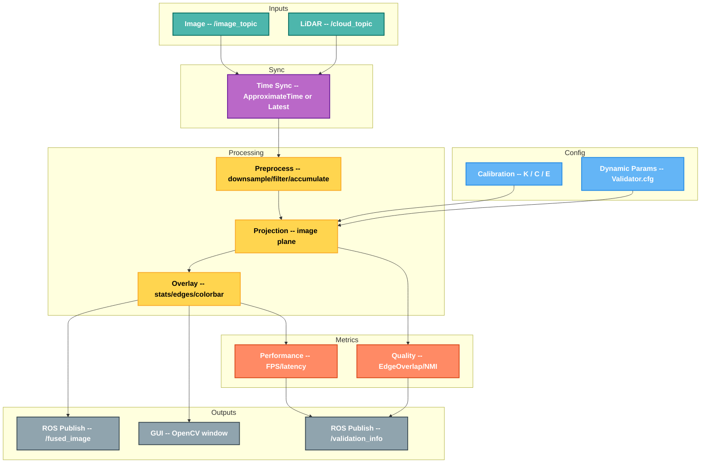

<h1 align="center">LiDAR-Camera Calibration Validator</h1>

A visualization and validation tool for LiDAR-camera calibration, providing real-time fusion display, quantitative metrics, and accurate projection.

<p align="center">
  
  
  
  
  
</p>

---

## Key Features

- Accurate projection with full distortion correction
- Quantitative metrics: edge overlap score and normalized mutual information
- Online parameter tuning via dynamic_reconfigure
- Edge detection analysis using Canny
- Performance monitoring with FPS and processing time
- Compatible with repeating and non-repeating LiDARs

---

## Showcase

<p align="center">
  
</p>

<p align="center">
  <em>Figure 1: System overview</em>
</p>

---

## System Flow



---

## Recommended Calibration Tools

Please complete camera calibration and LiDAR-camera extrinsic calibration first.

### Camera Calibration

- [ROS camera calibration](https://wiki.ros.org/camera_calibration)
- [Camera calibration tutorial](https://blog.csdn.net/2401_88008105/article/details/152665216?spm=1001.2014.3001.5506)

<p align="center">
  
</p>
<p align="center">
  <em>Figure 2: Camera calibration example</em>
</p>

---

### LiDAR-Camera Extrinsic Calibration

- [direct_visual_lidar_calibration](https://github.com/koide3/direct_visual_lidar_calibration)
- [Official tutorial](https://koide3.github.io/direct_visual_lidar_calibration/)

<p align="center">
  
</p>
<p align="center">
  <em>Figure 3: Calibration result</em>
</p>

<p align="center">
  
</p>
<p align="center">
  <em>Figure 4: Calibration process</em>
</p>

---

## Requirements

### Core Dependencies

- ROS Noetic (Ubuntu 20.04)
- OpenCV 4.x
- PCL 1.10+
- Eigen3
- dynamic_reconfigure

### Optional GUI Dependencies

- python3-rospkg
- ros-noetic-rqt-reconfigure
- ros-noetic-rqt-gui

---

## Installation

### Clone

```bash
mkdir -p ~/catkin_ws/src
cd ~/catkin_ws/src
git clone https://github.com/BreCaspian/LiDAR-Camera_Calibration_Validator.git
cd LiDAR-Camera_Calibration_Validator
```

### Check Dependencies

```bash
./scripts/quick_start.sh --check-deps
```

---

## Quick Start

### One-Command Launch

```bash
cd ~/catkin_ws/src/LiDAR-Camera_Calibration_Validator

vim ~/catkin_ws/src/LiDAR-Camera_Calibration_Validator/config/sample_calibration.yaml

./scripts/quick_start.sh -i /camera/image_raw -c /velodyne_points

./scripts/quick_start.sh --sync-mode latest --latest-threshold 0.2 \
    -i /galaxy_camera/image_raw -c /livox/lidar
```

### Advanced Options

```bash
./scripts/quick_start.sh --check-deps
./scripts/quick_start.sh --test
./scripts/quick_start.sh --force-compile
./scripts/quick_start.sh -i /camera/image_raw -c /velodyne_points
./scripts/quick_start.sh -f /path/to/your/calibration.yaml
./scripts/quick_start.sh --sync-mode latest --latest-threshold 0.2
./scripts/quick_start.sh --no-gui
./scripts/quick_start.sh --help
```

---

## Manual Launch

```bash
source /opt/ros/noetic/setup.bash
source ~/catkin_ws/devel/setup.bash

roslaunch lidar_cam_validator validator.launch

rosrun rqt_reconfigure rqt_reconfigure
```

---

## Calibration File

```bash
vim ~/catkin_ws/src/LiDAR-Camera_Calibration_Validator/config/sample_calibration.yaml
```

```yaml
K_0: !!opencv-matrix
   rows: 3
   cols: 3
   dt: d
   data: [fx, 0, cx, 0, fy, cy, 0, 0, 1]

C_0: !!opencv-matrix
   rows: 1
   cols: 5
   dt: d
   data: [k1, k2, p1, p2, k3]

E_0: !!opencv-matrix
   rows: 4
   cols: 4
   dt: d
   data: [R11, R12, R13, tx,
          R21, R22, R23, ty,
          R31, R32, R33, tz,
          0,   0,   0,   1]
```

---

## Topic Configuration

### Command Line (Recommended)

```bash
./scripts/quick_start.sh -i /your_camera/image_raw -c /your_lidar/cloudpoints
```

### Settings File

```bash
vim ~/catkin_ws/src/LiDAR-Camera_Calibration_Validator/config/settings.yaml
```

```yaml
image_topic: "/camera/image_raw"
cloud_topic: "/cloudpoints"

fused_topic: "/validator/fused_image"
info_topic: "/validator/validation_info"

calibration_file: "$(find lidar_cam_validator)/config/sample_calibration.yaml"
```

---

## Sync Modes and Non-Repeating LiDARs

### Sync Modes

- sync_mode=approximate (default): ApproximateTime for time-aligned sensors.
- sync_mode=latest or latest_pair: Pair by arrival time without hardware sync.
- latest_pair_time_threshold: warning threshold for arrival gap (seconds).

### Point Cloud Accumulation (Livox)

For sparse single frames:

1. Convert livox_ros_driver/CustomMsg to sensor_msgs/PointCloud2 using livox_repub or an equivalent node.
2. Enable enable_accumulation in rqt_reconfigure and tune time window, frames, and max points.

<p align="center">
  
  
</p>

<p align="center">
  <em>Figure 5: Non-repeating LiDAR example</em>
</p>

> [!TIP]
>**Notes:**
>
> 1.Why do point cloud gaps align better at longer distance?
>
>     This is expected due to parallax. At close range, the translation between camera and LiDAR creates large parallax, and small calibration errors lead to large pixel offsets.
>
>     At longer distance, translation effects diminish and rotation becomes dominant.
>
>     Recommended evaluation distance: 8-10 m (minimum 5 m).
>
> 2.Why does it always show "Poor"?
>
>     The metric is not adaptive and is meant for visualization guidance.
>
>     If distant outlines visually align, the calibration is usable.
>
>     The petal-like scan pattern of Mid-70 can disturb algorithms that rely on dense scan lines.
>
>     Livox non-repeating scans are sparse at close range, which lowers edge overlap score.
>
>     Do not over-trust the automatic score.

---

## Dynamic Parameters

Use rqt_reconfigure to adjust parameters in real time.

### Visualization

| Name | Type | Range | Default | Description |
|------|------|-------|---------|-------------|
| point_size | int | 1-8 | 3 | Point size in pixels |
| min_depth | double | 0.1-5.0 | 0.5 | Min depth for color mapping (m) |
| max_depth | double | 5.0-200.0 | 50.0 | Max depth for color mapping (m) |
| show_statistics | bool | - | true | Show statistics overlay |
| show_edge_overlay | bool | - | false | Show edge overlay |
| show_depth_colorbar | bool | - | true | Show depth colorbar |

### Performance

| Name | Type | Range | Default | Description |
|------|------|-------|---------|-------------|
| enable_downsampling | bool | - | false | Enable downsampling |
| max_points | int | 10000-1000000 | 1000000 | Max points to process |
| enable_accumulation | bool | - | false | Enable accumulation |
| accumulation_time_sec | double | 0.01-1.0 | 0.1 | Accumulation window (s) |
| accumulation_frames | int | 1-20 | 3 | Max accumulated frames |
| accumulation_max_points | int | 1000-2000000 | 200000 | Max points after accumulation |

### Filtering

| Name | Type | Range | Default | Description |
|------|------|-------|---------|-------------|
| filter_by_distance | bool | - | true | Enable distance filter |
| min_distance | double | 0.1-2.0 | 0.3 | Min distance (m) |
| max_distance | double | 10.0-200.0 | 100.0 | Max distance (m) |

### Metrics

| Name | Type | Range | Default | Description |
|------|------|-------|---------|-------------|
| enable_metrics | bool | - | true | Enable metrics |
| edge_threshold | int | 10-200 | 50 | Canny threshold |
| edge_distance_threshold | double | 1.0-20.0 | 5.0 | Edge distance threshold (px) |
| min_points_for_nmi | int | 50-1000 | 100 | Min points for NMI |

### Control

| Name | Type | Description |
|------|------|-------------|
| reset_to_defaults | bool | Reset all parameters |

---

## Output

### GUI

- Fused image with projected point cloud
- Depth color mapping
- Depth colorbar
- Statistics overlay

<p align="center">
  
</p>
<p align="center">
  <em>Figure 6: Visualization GUI</em>
</p>

### ROS Topics

- /validator/fused_image: fused image (sensor_msgs/Image)
- /validator/validation_info: metrics JSON (std_msgs/String)
- /validator_node/parameter_descriptions: parameter descriptions
- /validator_node/parameter_updates: parameter updates

---

## Project Structure

```
LiDAR-Camera_Calibration_Validator/
├── include/
│   └── calibration_validator.h
├── src/
│   ├── calibration_validator.cpp
│   └── validator_node.cpp
├── scripts/
│   └── quick_start.sh
├── config/
│   ├── Validator.cfg
│   ├── sample_calibration.yaml
│   └── settings.yaml
├── launch/
│   └── validator.launch
├── README.md
└── CMakeLists.txt
```

---

## Math Notes

- [Wiki](https://github.com/BreCaspian/LiDAR-Camera_Calibration_Validator/wiki)

---

## Contributing

1. Fork the repository
2. Create a branch: `git checkout -b feature/your-feature`
3. Commit changes: `git commit -am 'Add some feature'`
4. Push: `git push origin feature/your-feature`
5. Open a Pull Request

---

## Roadmap

- [x] Livox support
- [x] No external time sync dependency
- [ ] ROS2 support
- [ ] ROS-Docker support
- [ ] ROS2-Docker support

---

## License

This project is licensed under GPL-3.0-or-later. See `LICENSE` for details.

### Obligations

- Copyleft: derivatives must use the same license
- Source disclosure: provide source or access to source
- License preservation: keep original license and copyright
- Modification notice: clearly state changes

---

## Acknowledgments

- ROS community
- OpenCV and PCL
- Dr. Kenji Koide's calibration tool

---

## Contact

Author: Yao Yuzhuo
Email: yaoyuzhuo6@gmail.com
